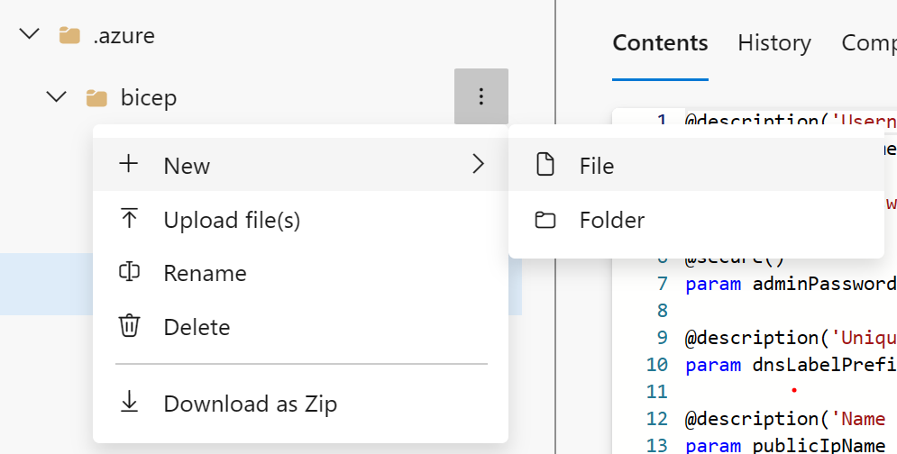

# Deployments using Azure Bicep templates

**Estimated time:** 45 minutes

You will learn how to create an Azure Bicep template and modularize it using the Azure Bicep Modules concept. You'll modify the main deployment template to use the module and deploy all the resources to Azure using Azure YAML pipelines.

## Before you start

You need:

- **Microsoft Edge** or an [Azure DevOps supported browser](https://docs.microsoft.com/azure/devops/server/compatibility)
- **Azure subscription:** You need an active Azure subscription or can create a new one
- **Azure DevOps organization:** Create one at [Create an organization or project collection](https://docs.microsoft.com/azure/devops/organizations/accounts/create-organization) if you don't have one
- **Account permissions:** You need a Microsoft account or Microsoft Entra account with:
  - Owner role in the Azure subscription
  - Global Administrator role in the Microsoft Entra tenant
  - For details, see [List Azure role assignments using the Azure portal](https://docs.microsoft.com/azure/role-based-access-control/role-assignments-list-portal) and [View and assign administrator roles in Azure Active Directory](https://docs.microsoft.com/azure/active-directory/roles/manage-roles-portal)

## About Azure Bicep

Azure Bicep is a domain-specific language (DSL) that uses declarative syntax to deploy Azure resources. It provides a more concise syntax compared to JSON templates while maintaining all the capabilities of Azure Resource Manager (ARM) templates.

Key benefits of Bicep:
- **Simplified syntax:** More readable and easier to write than JSON ARM templates
- **Modular design:** Support for modules to create reusable components
- **Strong typing:** IntelliSense support and compile-time validation
- **No state management:** Declarative syntax means you describe what you want, not how to get there

## Create and configure the team project

First, you'll create an Azure DevOps project for this lab.

1. In your browser, open your Azure DevOps organization
2. Click **New Project**
3. Give your project the name **eShopOnWeb**
4. Leave other fields with defaults
5. Click **Create**

   

## Import the eShopOnWeb Git Repository

Next, you'll import the sample repository that contains the application code and infrastructure templates.

1. In your Azure DevOps organization, open the **eShopOnWeb** project
2. Click **Repos > Files**
3. Click **Import a Repository**
4. Select **Import**
5. In the **Import a Git Repository** window, paste this URL: `https://github.com/MicrosoftLearning/eShopOnWeb.git`  
6. Click **Import**

   

The repository is organized this way:
- **.ado** folder contains Azure DevOps YAML pipelines
- **.devcontainer** folder contains setup to develop using containers
- **infra** folder contains Bicep & ARM infrastructure as code templates used in lab scenarios
- **.github** folder contains YAML GitHub workflow definitions
- **src** folder contains the .NET 8 website used in the lab scenarios

7. Go to **Repos > Branches**
8. Hover on the **main** branch then click the ellipsis on the right
9. Click **Set as default branch**

## Understand an Azure Bicep template and simplify it using a reusable module

You'll review an Azure Bicep template and simplify it using a reusable module.

### Create Azure Bicep template

You'll use the Azure DevOps editor to examine an Azure Bicep template.

1. In your Azure DevOps project, navigate to **Repos** and **Files**
2. Open the `infra` folder and find the `simple-windows-vm.bicep` file

   

3. Review the template to get a better understanding of its structure

The template includes:
- **Parameters** with types, default values and validation
- **Variables** for computed values
- **Resources** with these types:
  - Microsoft.Storage/storageAccounts
  - Microsoft.Network/publicIPAddresses
  - Microsoft.Network/virtualNetworks
  - Microsoft.Network/networkInterfaces
  - Microsoft.Compute/virtualMachines

Notice how simple the resource definitions are and the ability to implicitly reference symbolic names instead of explicit `dependsOn` throughout the template.

### Create a bicep module for storage resources

You'll create a storage template module **storage.bicep** which will create a storage account only and will be imported by the main template.

1. First, remove the storage resource from the main template. Click the **Edit** button:

   

2. Delete the storage resource:

   ```bicep
   resource storageAccount 'Microsoft.Storage/storageAccounts@2022-05-01' = {
     name: storageAccountName
     location: location
     sku: {
       name: 'Standard_LRS'
     }
     kind: 'Storage'
   }
   ```

3. Change the default value of the `publicIPAllocationMethod` parameter from `Dynamic` to `Static` at line 20
4. Change the default value of the `publicIpSku` parameter from `Basic` to `Standard` at line 27
5. Commit the file (we're not done with it yet)

   

6. Next, hover your mouse over the `Infra` folder and click the ellipsis icon
7. Select **New**, and **File**
8. Enter **storage.bicep** for the name and click **Create**

   

9. Copy the following code snippet into the file and commit your changes:

   ```bicep
   @description('Location for all resources.')
   param location string = resourceGroup().location

   @description('Name for the storage account.')
   param storageAccountName string

   resource storageAccount 'Microsoft.Storage/storageAccounts@2022-05-01' = {
     name: storageAccountName
     location: location
     sku: {
       name: 'Standard_LRS'
     }
     kind: 'Storage'
   }

   output storageURI string = storageAccount.properties.primaryEndpoints.blob
   ```

### Modify the simple-windows-vm template to use the template module

You'll modify the `simple-windows-vm.bicep` template to reference the template module you created.

1. Navigate back to the `simple-windows-vm.bicep` file and click **Edit**
2. Add the following code after the variables:

   ```bicep
   module storageModule './storage.bicep' = {
     name: 'linkedTemplate'
     params: {
       location: location
       storageAccountName: storageAccountName
     }
   }
   ```

3. Modify the reference to the storage account blob URI in the virtual machine resource to use the output of the module
4. Find the virtual machine resource and replace the diagnosticsProfile section with:

   ```bicep
   diagnosticsProfile: {
     bootDiagnostics: {
       enabled: true
       storageUri: storageModule.outputs.storageURI
     }
   }
   ```

5. Review the following details in the main template:
   - A module in the main template is used to link to another template
   - The module has a symbolic name called `storageModule` used for configuring dependencies
   - You can only use **Incremental** deployment mode when using template modules
   - A relative path is used for your template module
   - Parameters pass values from the main template to the template modules

6. Commit the template

## Deploy the templates to Azure using YAML pipelines

You'll use an Azure DevOps YAML pipeline to deploy your template to your Azure environment.

### Deploy resources to Azure by YAML pipelines

1. Navigate back to the **Pipelines** pane in the **Pipelines** hub
2. In the **Create your first Pipeline** window, click **Create pipeline**
3. On the **Where is your code?** pane, click **Azure Repos Git (YAML)**
4. On the **Select a repository** pane, click **eShopOnWeb**
5. On the **Configure your pipeline** pane, scroll down and select **Existing Azure Pipelines YAML File**
6. In the **Selecting an existing YAML File** blade, specify:
   - Branch: **main**
   - Path: **.ado/eshoponweb-cd-windows-cm.yml**
7. Click **Continue** to save these settings
8. In the variables section:
   - Choose a name for your resource group
   - Set the desired location
   - Replace the value of the service connection with one of your existing service connections
9. Click the **Save and run** button from the top right corner

   

10. When the commit dialog appears, click **Save and run** again
11. Wait for the deployment to finish and review the results

    

> **Note**: Remember to give the pipeline permission to use the previously created Service Connection if prompted.

## Clean up resources

Remember to delete the resources created in the Azure portal to avoid unnecessary charges:

1. In the Azure portal, navigate to the resource group you created
2. Click **Delete resource group**
3. Type the resource group name to confirm deletion
4. Click **Delete**

## Summary

In this lab, you learned how to:

- **Understand an Azure Bicep template's structure** including parameters, variables, and resources
- **Create a reusable Bicep module** for storage resources
- **Modify the main template** to use the module and updated dependencies
- **Deploy templates to Azure** using YAML pipelines

Azure Bicep provides a powerful way to define and deploy Azure infrastructure as code. By using modules, you can create reusable components that make your infrastructure templates more maintainable and organized. The integration with Azure DevOps pipelines enables automated deployment of your infrastructure alongside your applications.
