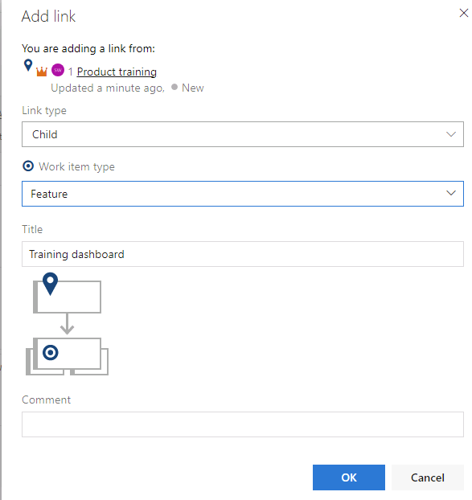
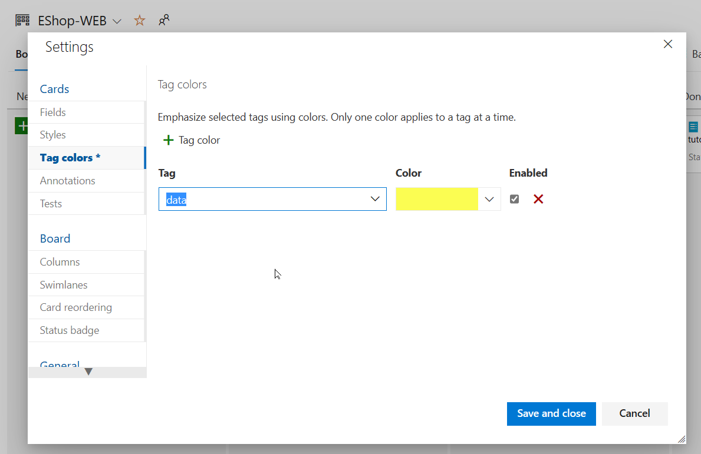

---
lab:
  topic: Basic
  title: "Agile Planning and Portfolio Management with Azure Boards"
  description: "Learn about the agile planning and portfolio management tools and processes provided by Azure Boards and how they can help you quickly plan, manage, and track work across your entire team."
---

# Agile Planning and Portfolio Management with Azure Boards

In this lab, you'll learn about the agile planning and portfolio management tools and processes provided by Azure Boards and how they can help you quickly plan, manage, and track work across your entire team. You'll explore the product backlog, sprint backlog, and task boards that can track the flow of work during an iteration. We'll also look at the enhanced tools in this release to scale for larger teams and organizations.

You will learn how to:

- Manage teams, areas, and iterations.
- Manage work items.
- Manage sprints and capacity.
- Customize Kanban boards.
- Define dashboards.
- Customize team process.

This lab takes approximately **60** minutes to complete.

## Before you start

To complete the lab, you need:

- **Microsoft Edge** or an [Azure DevOps supported browser.](https://docs.microsoft.com/azure/devops/server/compatibility?view=azure-devops#web-portal-supported-browsers)
- An active Azure subscription. If you don't have one, you can create a free account at [Azure Free Account](https://azure.microsoft.com/free).
- An Azure DevOps organization. If you don't already have one, create one by following the instructions at [Create an organization or project collection](https://docs.microsoft.com/azure/devops/organizations/accounts/create-organization?view=azure-devops).

### Set up Azure DevOps organization (if needed)

If you don't already have an Azure DevOps organization, follow these steps:

1. Use a private browser session to get a new **personal Microsoft Account (MSA)** at `https://account.microsoft.com` (skip if you already have one).
1. Using the same browser session, sign up for a free Azure subscription at `https://azure.microsoft.com/free` (skip if you already have one).
1. Open a browser and navigate to Azure portal at `https://portal.azure.com`, then search at the top of the Azure portal screen for **Azure DevOps**. In the resulting page, click **Azure DevOps organizations**.
1. Next, click on the link labelled **My Azure DevOps Organizations** or navigate directly to `https://aex.dev.azure.com`.
1. On the **We need a few more details** page, select **Continue**.
1. In the drop-down box on the left, choose **Default Directory**, instead of **Microsoft Account**.
1. If prompted (_"We need a few more details"_), provide your name, e-mail address, and location and click **Continue**.
1. Back at `https://aex.dev.azure.com` with **Default Directory** selected click the blue button **Create new organization**.
1. Accept the _Terms of Service_ by clicking **Continue**.
1. If prompted (_"Almost done"_), leave the name for the Azure DevOps organization at default (it needs to be a globally unique name) and pick a hosting location close to you from the list.
1. Once the newly created organization opens in **Azure DevOps**, select **Organization settings** in the bottom left corner.
1. At the **Organization settings** screen select **Billing** (opening this screen takes a few seconds).
1. Select **Setup billing** and on the right-hand side of the screen, select your **Azure Subscription** and then select **Save** to link the subscription with the organization.
1. Once the screen shows the linked Azure Subscription ID at the top, change the number of **Paid parallel jobs** for **MS Hosted CI/CD** from 0 to **1**. Then select **SAVE** button at the bottom.

   > **Note**: You may **wait a couple of minutes before using the CI/CD capabilities** so that the new settings are reflected in the backend. Otherwise, you will still see the message _"No hosted parallelism has been purchased or granted"_.

1. In **Organization Settings**, go to section **Pipelines** and click **Settings**.
1. Toggle the switch to **Off** for **Disable creation of classic build pipelines** and **Disable creation of classic release pipelines**.
1. In **Organization Settings**, go to section **Security** and click **Policies**.
1. Toggle the switch to **On** for **Allow public projects**.

### Create and configure the Azure DevOps project (if needed)

1. Open your browser and navigate to your Azure DevOps organization.
1. Select the **New Project** option and use the following settings:
   - name: **eShopOnWeb**
   - visibility: **Private**
   - Advanced: Version Control: **Git**
   - Advanced: Work Item Process: **Scrum**
1. Select **Create**.

   

### Import eShopOnWeb git repository (if needed)

1. Open the previously created **eShopOnWeb** project.
1. Select the **Repos > Files**, **Import a Repository** and then select **Import**.
1. On the **Import a Git Repository** window, paste the following URL `https://github.com/MicrosoftLearning/eShopOnWeb` and select **Import**:

   

1. The repository is organized the following way:

   - **.ado** folder contains Azure DevOps YAML pipelines.
   - **.devcontainer** folder container setup to develop using containers (either locally in VS Code or GitHub Codespaces).
   - **.azure** folder contains Bicep & ARM infrastructure as code templates.
   - **.github** folder container YAML GitHub workflow definitions.
   - **src** folder contains the .NET 8 website used on the lab scenarios.

1. Leave the web browser window open.
1. Go to **Repos > Branches**.
1. Hover on the **main** branch then click the ellipsis on the right of the column.
1. Click on **Set as default branch**.

## Manage teams, areas, and iterations

Each new project is configured with a default team, which name matches the project name. You have the option of creating additional teams. Each team can be granted access to a suite of Agile tools and team assets. The ability to create multiple teams gives you the flexibility to choose the proper balance between autonomy and collaboration across the enterprise.

1. On your lab computer, start a web browser and navigate to the Azure DevOps portal at `https://aex.dev.azure.com`.

   > **Note**: If prompted, sign in using the Microsoft account associated with your Azure DevOps subscription.

1. Open the **eShopOnWeb** project under your Azure DevOps organization.

   > **Note**: Alternatively, you can access the project page directly by navigating to the <https://dev.azure.com/YOUR-AZURE-DEVOPS-ORGANIZATION/PROJECT-NAME> URL, where the YOUR-AZURE-DEVOPS-ORGANIZATION placeholder, represents your account name, and the PROJECT-NAME placeholder represents the name of the project.

1. Click the cogwheel icon labeled **Project settings** located in the lower left corner of the page to open the **Project settings** page.

   

1. In the **General** section, select the **Teams** tab. There is already a default team in this project, **eShopOnWeb Team** but you'll create a new one for this lab. Click **New Team**.

   

1. On the **Create a new team** pane, in the **Team name** textbox, type **`EShop-Web`**, leave other settings with their default values, and click **Create**.

   

1. In the list of **Teams**, select the newly created team to view its details.

   > **Note**: By default, the new team has only you as its member. You can use this view to manage such functionality as team membership, notifications, and dashboards.

1. Click **Iterations and Area Paths** link at the top of the **EShop-Web** page to start defining the schedule and scope of the team.

   

1. At the top of the **Boards** pane, select the **Iterations** tab and then click **+ Select iteration(s)**.

   

1. Select **eShopOnWeb\Sprint 1** and click **Save and close**. Note that this first sprint will show up in the list of iterations, but the Dates are not set yet.
1. Select **Sprint 1** and click the **ellipsis (...)**. From the context menu, select **Edit**.

   > **Note**: Specify the Start Date as the first work day of last week, and count 3 full work weeks for each sprint. For example, if March 6 is the first work day of the sprint, it goes until March 24th. Sprint 2 starts on March 27, which is 3 weeks out from March 6.

1. Repeat the previous step to add **Sprint 2** and **Sprint 3**. You could say that we are currently in the 2nd week of the first sprint.

   

1. Still in the **Project Settings / Boards / Team Configuration** pane, at the top of the pane, select the **Areas** tab. You will find there an automatically generated area with the name matching the name of the team.

   

1. Click the ellipsis symbol (...) next to the **default area** entry and, in the dropdown list, select **Include sub areas**.

   > **Note**: The default setting for all teams is to exclude sub-area paths. We will change it to include sub-areas so that the team gets visibility into all of the work items from all teams. Optionally, the management team could also choose to not include sub-areas, which automatically removes work items from their view as soon as they are assigned to one of the teams.

## Manage work items

Work items play a prominent role in Azure DevOps. Whether describing work to be done, impediments to release, test definitions, or other key items, work items are the workhorse of modern projects. In this task you'll focus on using various work items to set up the plan to extend the eShopOnWeb site with a product training section. While it can be daunting to build out such a substantial part of a company's offering, Azure DevOps and the Scrum process make it very manageable.

> **Note**: This task is designed to illustrate a variety of ways you can create different kinds of work items, as well as to demonstrate the breadth of features available on the platform. As a result, these steps should not be viewed as prescriptive guidance for project management. The features are intended to be flexible enough to fit your process needs, so explore and experiment as you go.

1. Click on the project name in the upper left corner of the Azure DevOps portal to return to the project home page.

1. In the vertical navigational pane of the Azure DevOps portal, select the **Boards** icon and, select **Work Items**.

   > **Note**: There are many ways to create work items in Azure DevOps, and we'll explore a few of them. Sometimes it's as simple as firing one off from a dashboard.

1. On the **Work Items** window, click on **+ New Work Item > Epic**.

   

1. In the **Enter title** textbox, type **`Product training`**.
1. In the upper left corner, select the **No one selected** entry and, in the dropdown list, select your user account in order to assign the new work item to yourself. If your name doesn't appear to start with, begin typing your name and click **Search**.
1. Next to the **Area** entry, select the **eShopOnWeb** entry and, in the dropdown list, select **EShop-WEB**. This will set the **Area** to **eShopOnWeb\EShop-WEB**.
1. Next to the **Iteration** entry, select the **eShopOnWeb** entry and, in the dropdown list, select **Sprint 2**. This will set the **Iteration** to **eShopOnWeb\Sprint 2**.
1. Click **Save** to finalize your changes. **Do not close it**.

   > **Note**: The work item form includes all of the relevant work item settings. This includes details about who it's assigned to, its status across many parameters, and all the associated information and history for how it has been handled since creation. One of the key areas to focus on is the **Related Work**. We will explore one of the ways to add a feature to this epic.

1. In the **Related work** section on the lower right-side, select the **Add link** entry and, in the dropdown list, select **New item**.
1. On the **Add link** panel, in the **Link Type** dropdown list, select **Child**. Next, in the **Work item type** dropdown list, select **Feature**, in the **Title** textbox, type **`Training dashboard`**.

   

1. Click **Add link** to save the Child item

   > **Note**: On the **Training dashboard** panel, note that the assignment, **Area**, and **Iteration** are already set to the same values as the epic that the feature is based on. In addition, the feature is automatically linked to the parent item it was created from.

1. On the (New Feature) **Training dashboard** panel, click **Save and Close**.

1. In the vertical navigation pane of the Azure DevOps portal, in the list of the **Boards** items, select **Boards**.
1. On the **Boards** panel, select the **EShop-WEB boards** entry. This will open the board for that particular team.

   

1. On the **Boards** panel, in the upper right corner, select the **Backlog items** entry and, in the dropdown list, select **Features**.

   > **Note**: This will make it easy to add tasks and other work items to the features.

1. Hover with the mouse pointer over the rectangle representing the **Training dashboard** feature. This will reveal the ellipsis symbol (...) in its upper right corner.
1. Click the ellipsis (...) icon and, in the dropdown list, select **Add Product Backlog Item**.

   

1. In the textbox of the new product backlog item, type **`As a customer, I want to view new tutorials`** and press the **Enter** key to save the entry.

   > **Note**: This creates a new product backlog item (PBI) work item that is a child of the feature and shares its area and iteration.

1. Repeat the previous step to add two more PBIs designed to enable the customer to see their recently viewed tutorials and to request new tutorials named, respectively, **`As a customer, I want to see tutorials I recently viewed`** and **`As a customer, I want to request new tutorials`**.

   

1. On the **Boards** panel, in the upper right corner, select the **Features** entry and, in the dropdown list, select **Backlog items**.

   > **Note**: Backlog items have a state that defines where they are relative to being completed. While you could open and edit the work item using the form, it's easier to just drag cards on the board.

1. On the **Board** tab of the **EShop-WEB** panel, drag the first work item named **As a customer, I want to view new tutorials** from the **New** to **Approved** stage.

   > **Note**: You can also expand work item cards to get to conveniently editable details.

1. Hover with the mouse pointer over the rectangle representing the work item you moved to the **Approved** stage. This will reveal the down facing caret symbol.
1. Click the down facing caret symbol to expand the work item card, replace the **Unassigned** entry with your name, then select your account to assign the moved PBI to yourself.
1. On the **Board** tab of the **EShop-WEB** panel, drag the second work item named **As a customer, I want to see tutorials I recently viewed** from the **New** to the **Committed** stage.
1. On the **Board** tab of the **EShop-WEB** panel, drag the third work item named **As a customer, I want to request new tutorials** from the **New** to the **Done** stage.

   > **Note**: The task board is one view into the backlog. You can also use the tabular view.

1. On the **Board** tab of the **EShop-WEB** pane, at the top of the pane, click **View as Backlog** to display the tabular form.

   > **Note**: You can use the second plus sign directly left to the first backlog item to add a new task to it.

1. On the **Backlog** tab of the **EShop-WEB** pane, in the upper left corner of the pane, click the plus sign next to the first work item. This will display the **NEW TASK** panel.

   

1. At the top of the **NEW TASK** panel, in the **Enter title** textbox, type **`Add page for most recent tutorials`**.
1. On the **NEW TASK** panel, in the **Remaining Work** textbox, type **5**.
1. On the **NEW TASK** panel, in the **Activity** dropdown list, select **Development**.
1. On the **NEW TASK** panel, click **Save and Close**.

   

1. Repeat the last five steps to add another task named **`Optimize data query for most recent tutorials`**. Set its **Remaining Work** to **3** and its **Activity** to **Design**. Click **Save and Close** once completed.

## Manage sprints and capacity

Teams build the sprint backlog during the sprint planning meeting, typically held on the first day of the sprint. Each sprint corresponds to a time-boxed interval which supports the team's ability to work using Agile processes and tools. During the planning meeting, the product owner works with the team to identify those stories or backlog items to complete in the sprint.

Planning meetings typically consist of two parts. In the first part, the team and product owner identify the backlog items that the team feels it can commit to completing in the sprint, based on experience with previous sprints. These items get added to the sprint backlog. In the second part, the team determines how it will develop and test each item. They then define and estimate the tasks required to complete each item. Finally, the team commits to implementing some or all the items based on these estimates.

The sprint backlog should contain all the information the team needs to successfully plan and complete work within the time allotted without having to rush at the end. Before planning the sprint, you'd want to have created, prioritized, and estimated the backlog and defined the sprints.

1. In the vertical navigational pane of the Azure DevOps portal, select the **Boards** icon and, in the list of the **Boards** items, select **Sprints**.
1. On the **Taskboard** tab of the **Sprints** view, in the toolbar, on the right hand side, select the **View options** symbol (directly to the left of the funnel icon) and, in the **View options** dropdown list, select the **Work details** entry. Select **Sprint 2** as filter.

   > **Note**: The current sprint has a pretty limited scope. There are two tasks in the **To do** stage. At this point, neither task has been assigned. Both show a numeric value to the right of **Unassigned** entry representing the remaining work estimate.

1. Within the **ToDo** Column, notice the Task Item **Add page for most recent tutorials**, click the **Unassigned** entry and, in the list of user accounts, select your account to assign the task to yourself.

1. Select the **Capacity** tab of the **Sprints** view.

   > **Note**: This view enables you to define what activities a user can take on and at what level of capacity.

1. On the **Capacity** tab of the **Sprints** view, for your user account, set the **Activity** field to **Development** and, in the **Capacity per day** textbox, type **1**. Then click **Save**.

   > **Note**: Let's assume you're also going to take some vacation. Which should be added to the capacity view too.

1. On the **Capacity** tab of the **Sprints** view, directly next to the entry representing your user account, in the **Days off** column, click the **0 days** entry. This will display a panel where you can set your days off.
1. In the displayed panel, use the calendar view to set your vacation to span five work days during the current sprint (within the next three weeks) and, once completed, click **OK**.

   

1. Back on the **Capacity** tab of the **Sprints** view, click **Save**.

## Customize Kanban boards

To maximize a team's ability to consistently deliver high quality software, Kanban emphasizes two main practices. The first, visualizing the flow of work, requires that you map your team's workflow stages and configure a Kanban board to match. The second, constraining the amount of work in progress, requires that you set work-in-progress (WIP) limits. You're then ready to track progress on your Kanban board and monitor key metrics to reduce lead or cycle time. Your Kanban board turns your backlog into an interactive signboard, providing a visual flow of work. As work progresses from idea to completion, you update the items on the board. Each column represents a work stage, and each card represents a user story (blue cards) or a bug (red cards) at that stage of work. However, every team develops its own process over time, so the ability to customize the Kanban board to match the way your team works is critical for the successful delivery.

1. In the vertical navigational pane of the Azure DevOps portal, in the list of the **Boards** items, select **Boards**.
1. On the **Boards** panel, click the **Configure board settings** cogwheel icon (directly to the right of the funnel icon).

   > **Note**: The team is emphasizing work done with data, so there is special attention paid to any task associated with accessing or storing data.

1. On the **Settings** panel, select the **Tag colors** tab, click **+ Add tag color**, in the **Tag** textbox, type **`data`** and select the yellow rectangle.

   

   > **Note**: Whenever a backlog item or bug is tagged with **data**, that tag will be highlighted.

1. Select the **Annotations** tab.

   > **Note**: You can specify which **Annotations** you would like included on cards to make them easier to read and navigate. When an annotation is enabled, the child work items of that type are easily accessible by clicking the visualization on each card.

1. Select the **Tests** tab.

   > **Note**: The **Tests** tab enables you to configure how tests appear and behave on the cards.

1. Click **Save** to save and close the settings.
1. From the **Board** tab of the **EShop-WEB** panel, open the Work Item representing the **As a customer, I want to view new tutorials** backlog item.
1. From the detailed item view, at the top of the panel, to the right of the **0 comments** entry, click **Add tag**.
1. In the resulting textbox, type **`data`** and press the **Enter** key.
1. Repeat the previous step to add the **`ux`** tag.
1. Save these edits by clicking **Save and Close**.

   

   > **Note**: The two tags are now visible on the card, with the **data** tag highlighted in yellow as configured.

1. On the **Boards** panel, click the **Configure board settings** cogwheel icon (directly to the right of the funnel icon).
1. On the **Settings** panel, select the **Columns** tab.

   > **Note**: This section allows you to add new stages to the workflow.

1. Click **+ Add column**, under the **Column name** label, in the **Name** textbox, type **`QA Approved`** and, in the **WIP limit** textbox, type **1**

   > **Note**: The Work in progress limit of 1 indicates that only one work item should be in this stage at a time. You would ordinarily set this higher, but there are only two work items to demonstrate the feature.

1. Notice the ellipsis next to the **QA Approved** column you created. Select **Move right** twice, so that the QA Approved column gets positioned in-between **Committed** and **Done**.
1. Click **Save** to save and close the settings.

1. On the **Boards portal**, the **QA Approved** column is now visible in the Kanban board view.
1. Drag the **As a customer, I want to see tutorials I recently viewed** work item from the **Committed** stage into the **QA Approved** stage.
1. Drag the **As a customer, I want to view new tutorials** work item from the **Approved** stage into the **QA Approved** stage.

   

   > **Note**: The stage now exceeds its **WIP** limit and is colored red as a warning.

1. Move the **As a customer, I want to see tutorials I recently viewed** backlog item back to **Committed**.
1. On the **Boards** panel, click the **Configure board settings** cogwheel icon (directly to the right of the funnel icon).
1. On the **Settings** panel, return to the **Columns** tab and select the **QA Approved** tab.

   > **Note**: A lag often exists between when work gets moved into a column and when work starts. To counter that lag and reveal the actual state of work in progress, you can turn on split columns. When split, each column contains two sub-columns: **Doing** and **Done**. Split columns let your team implement a pull model. Without split columns, teams push work forward, to signal that they've completed their stage of work. However, pushing it to the next stage doesn't necessarily mean that a team member immediately starts work on that item.

1. On the **QA Approved** tab, enable the **Split column into doing and done** checkbox to create two separate columns.

   > **Note**: As your team updates the status of work as it progresses from one stage to the next, it helps that they agree on what **done** means. By specifying the **Definition of done** criteria for each Kanban column, you help share the essential tasks to complete before moving an item into a downstream stage.

1. On the **QA Approved** tab, at the bottom of the panel, in the **Definition of done** textbox, type **`Passes **all** tests`**.
1. Click **Save** to save and close the settings.

   > **Note**: The **QA Approved** stage now has **Doing** and **Done** columns. You can also click the informational symbol (with letter **i** in a circle) next to the column header to read the **Definition of done**. You may need to refresh the browser to see changes.

1. On the **Boards** panel, click the **Configure boards settings** cogwheel icon (directly to the right of the funnel icon).

   > **Note**: Your Kanban board supports your ability to visualize the flow of work as it moves from new to done. When you add **swimlanes**, you can also visualize the status of work that supports different service-level classes. You can create a swimlane to represent any other dimension that supports your tracking needs.

1. On the **Settings** panel, select the **Swimlanes** tab.
1. On the **Swimlanes** tab, click **+ Add swimlane**, directly under the **Swimlane name** label, in the **Name** textbox, type **`Expedite`**.
1. In the **Color** dropdown list, select the **Green** rectangle.
1. Click **Save** to save and close the settings.

   

1. Back on the **Board** tab of the **Boards** panel, drag and drop the **Committed** work item onto the **QA Approved \| Doing** stage of the **Expedite** swimlane so that it gets recognized as having priority when QA bandwidth becomes available.

   > **Note**: You may need to refresh the browser to make the swimlane visible.

## Define dashboards

Dashboards allow teams to visualize status and monitor progress across the project. At a glance, you can make informed decisions without having to drill down into other parts of your team project site. The Overview page provides access to a default team dashboard which you can customize by adding, removing, or rearranging the tiles. Each tile corresponds to a widget that provides access to one or more features or functions.

1. In the vertical navigational pane of the Azure DevOps portal, select the **Overview** icon and, in the list of the **Overview** items, select **Dashboards**.
1. Select the **Overview** for the **eShopOnWeb Team** and review the existing dashboard.

   

1. On the **Dashboards** pane, in the upper-right corner, select **+ New Dashboard**.

1. On the **Create a dashboard** pane, in the **Name** textbox, type **`Product training`**, in the **Team** dropdown list, select the **EShop-WEB** team, and click **Create**.

   

1. On the new dashboard pane, click **Add a widget**.
1. On the **Add Widget** panel, in the **Search widgets** textbox, type **`sprint`** to find existing widgets that focus on sprints. In the list of results, select **Sprint Overview** and click **Add**.
1. In the rectangle representing the newly added widget, click the **Settings** cogwheel icon and review the **Configuration** pane.

   > **Note**: The customization level will vary by widget.

1. On the **Configuration** pane, click **Close** without making any changes.
1. Back on the **Add Widget** pane, in the **Search** textbox, type **`sprint`** again to find existing widgets that focus on sprints. In the list of results, select **Sprint Capacity** and click **Add**.

   > **Note**: If the widget shows "Set capacity to use the sprint capacity widget", you can select the **Set capacity** link to set the capacity. Set the Activity to Development and the Capacity to 1. Click **Save** and back to the dashboard.

1. In the **Dashboard** view, at the top of the pane, click **Done Editing**.

   

   > **Note**: You can now review two important aspects of your current sprint on your custom dashboard.

   > **Note**: Another way of customizing dashboards is to generate charts based on work item queries, which you can share to a dashboard.

1. In the vertical navigational pane of the Azure DevOps portal, select the **Boards** icon and, in the list of the **Boards** items, select **Queries**.
1. On the **Queries** pane, click **+ New query**.
1. On the **Editor** tab of **Queries > My Queries** pane, in the **Value** dropdown list of the **Work Item Type** row, select **Task**.
1. Click on **Add new clause**, and in the **Field** column, select **Area Path** and, in the corresponding **Value** dropdown list, select **eShopOnWeb\\EShop-WEB**.
1. Click **Save**.

   

1. In the **Enter name** textbox, type **`Web tasks`**, in the **Folder** dropdown list, select **Shared Queries**, and click **OK**.
1. On the **Queries > Shared Queries** pane, click **Web tasks** to open the query.
1. Select the **Charts** tab and click **New chart**.
1. On the **Configure Chart** panel, in the **Name** textbox, type **`Web tasks - By assignment`**, in the **Group by** dropdown list, select **Assigned To**, and click **Save chart** to save the changes.

   

   > **Note**: You can now add this chart to a dashboard.

1. Return to the **Dashboards** section in the **Overview** Menu. From the **EShop-Web** section, select the **Product Training** dashboard you used earlier, to open it.

1. Click **Edit** from the top menu. From the **Add Widget** list, search for **`Chart`** , and select **Chart for Work Items**. Click **Add** to add this widget to the EShop-Web dashboard.

1. Click the **configure** (cogwheel) within the **Chart for Work Items** to open the widget settings.

1. Accept the title as is. Under **Query**, select **Shared Queries / Web Tasks**. Keep **Pie** for Chart Type. Under **Group By**, select **Assigned To**. Keep the Aggregation (Count) and Sort (Value / Ascending) defaults.

1. Confirm the configuration by clicking **Save**.

1. Notice the query results pie chart is shown on the dashboard. **Save** the changes by pressing the **Done Editing** button on top.

## Clean up resources

You don't need to clean up your Azure DevOps organization or project, as they will remain available for you to use as a reference and portfolio item. Azure DevOps provides free tier usage that includes basic features for small teams.

If you want to delete the project, you can do so by following these steps:

1. In your browser navigate to the Azure DevOps portal at `https://aex.dev.azure.com`.
1. Navigate to the **eShopOnWeb** project you created.
1. On the project settings page, go to **Overview** and click **Delete** at the bottom of the page.
1. Type the project name to confirm deletion and click **Delete**.

> **CAUTION:** Deleting a project deletes all work items, repositories, builds, and other project artifacts. If you used an existing project for this exercise, any existing resources outside the scope of this exercise will also be deleted.
