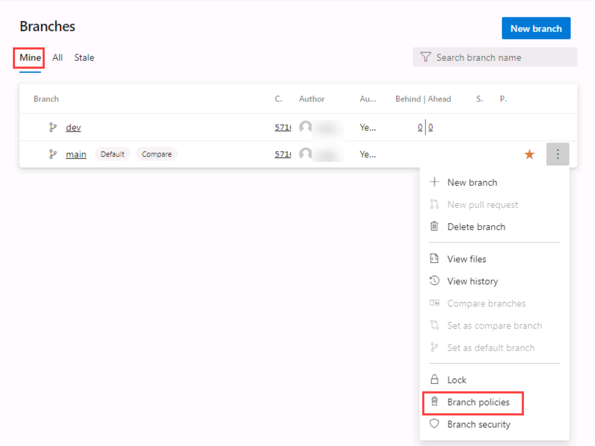

---
lab:
  topic: Basic
  title: "Version Control with Git in Azure Repos"
  description: "Learn to establish a local Git repository, which can easily be synchronized with a centralized Git repository in Azure DevOps. You'll also learn about Git branching and merging support using Visual Studio Code."
---

# Version Control with Git in Azure Repos

In this lab, you'll learn to establish a local Git repository, which can easily be synchronized with a centralized Git repository in Azure DevOps. In addition, you'll learn about Git branching and merging support. You'll use Visual Studio Code, but the same processes apply to using any Git-compatible client.

Azure DevOps supports two types of version control, Git and Team Foundation Version Control (TFVC). Git is a distributed version control system where each developer has a copy of the source repository on their dev machine. Git is the default version control provider for new projects and should be used unless you need centralized version control features in TFVC.

You will learn how to:

- Clone an existing repository.
- Save work with commits.
- Review history of changes.
- Work with branches by using Visual Studio Code.

This lab takes approximately **45** minutes to complete.

## Before you start

To complete the lab, you need:

- **Microsoft Edge** or an [Azure DevOps supported browser.](https://docs.microsoft.com/azure/devops/server/compatibility)
- An Azure DevOps organization. If you don't already have one, create one by following the instructions at [Create an organization or project collection](https://docs.microsoft.com/azure/devops/organizations/accounts/create-organization).
- **Git 2.47.0 or later**: If you don't have Git installed yet, navigate to the [Git for Windows download page](https://gitforwindows.org/) download it, and install it.
- **Visual Studio Code**: If you don't have Visual Studio Code installed yet, navigate to the [Visual Studio Code download page](https://code.visualstudio.com/), download it, and install it.
- **Visual Studio C# extension**: If you don't have Visual Studio C# extension installed yet, navigate to the [C# extension installation page](https://marketplace.visualstudio.com/items?itemName=ms-dotnettools.csharp) and install it.

### Set up Azure DevOps organization (if needed)

If you don't already have an Azure DevOps organization, follow these steps:

1. Use a private browser session to get a new **personal Microsoft Account (MSA)** at `https://account.microsoft.com` (skip if you already have one).
1. Using the same browser session, sign up for a free Azure subscription at `https://azure.microsoft.com/free` (skip if you already have one).
1. Open a browser and navigate to Azure portal at `https://portal.azure.com`, then search at the top of the Azure portal screen for **Azure DevOps**. In the resulting page, select **Azure DevOps organizations**.
1. Next, select the link labelled **My Azure DevOps Organizations** or navigate directly to `https://aex.dev.azure.com`.
1. On the **We need a few more details** page, select **Continue**.
1. In the drop-down box on the left, choose **Default Directory**, instead of **Microsoft Account**.
1. If prompted (_"We need a few more details"_), provide your name, e-mail address, and location and select **Continue**.
1. Back at `https://aex.dev.azure.com` with **Default Directory** selected select the blue button **Create new organization**.
1. Accept the _Terms of Service_ by clicking **Continue**.
1. If prompted (_"Almost done"_), leave the name for the Azure DevOps organization at default (it needs to be a globally unique name) and pick a hosting location close to you from the list.
1. Once the newly created organization opens in **Azure DevOps**, select **Organization settings** in the bottom left corner.
1. At the **Organization settings** screen select **Billing** (opening this screen takes a few seconds).
1. Select **Setup billing** and on the right-hand side of the screen, select your **Azure Subscription** and then select **Save** to link the subscription with the organization.
1. Once the screen shows the linked Azure Subscription ID at the top, change the number of **Paid parallel jobs** for **MS Hosted CI/CD** from 0 to **1**. Then select **SAVE** button at the bottom.

   > **Note**: You may **wait a couple of minutes before using the CI/CD capabilities** so that the new settings are reflected in the backend. Otherwise, you will still see the message _"No hosted parallelism has been purchased or granted"_.

1. In **Organization Settings**, go to section **Pipelines** and select **Settings**.
1. Toggle the switch to **Off** for **Disable creation of classic build pipelines** and **Disable creation of classic release pipelines**.
1. In **Organization Settings**, go to section **Security** and select **Policies**.
1. Toggle the switch to **On** for **Allow public projects**.

### Create and configure the Azure DevOps project (if needed)

1. Open your browser and navigate to your Azure DevOps organization.
1. Select the **New Project** option and use the following settings:
   - name: **eShopOnWeb**
   - visibility: **Private**
   - Advanced: Version Control: **Git**
   - Advanced: Work Item Process: **Scrum**
1. Select **Create**.

   

### Import eShopOnWeb git repository (if needed)

1. Open the previously created **eShopOnWeb** project.
1. Select the **Repos > Files**, **Import a Repository** and then select **Import**.
1. On the **Import a Git Repository** window, paste the following URL `https://github.com/MicrosoftLearning/eShopOnWeb.git` and select **Import**:

   

1. The repository is organized the following way:

   - **.ado** folder contains Azure DevOps YAML pipelines.
   - **.devcontainer** folder container setup to develop using containers (either locally in VS Code or GitHub Codespaces).
   - **.azure** folder contains Bicep & ARM infrastructure as code templates.
   - **.github** folder container YAML GitHub workflow definitions.
   - **src** folder contains the .NET 8 website used on the lab scenarios.

1. Leave the web browser window open.
1. Go to **Repos > Branches**.
1. Hover on the **main** branch then select the ellipsis on the right of the column.
1. Select **Set as default branch**.

### Configure Git and Visual Studio Code

1. On the lab computer, open **Visual Studio Code**.
1. In the Visual Studio Code interface, from the main menu, select **Terminal \| New Terminal** to open the **TERMINAL** pane.
1. Make sure that the current Terminal is running **PowerShell** by checking if the drop-down list at the top right corner of the **TERMINAL** pane shows **1: powershell**

   > **Note**: To change the current Terminal shell to **PowerShell** select the drop-down list at the top right corner of the **TERMINAL** pane and select **Select Default Shell**. At the top of the Visual Studio Code window select your preferred terminal shell **Windows PowerShell** and select the plus sign on the right-hand side of the drop-down list to open a new terminal with the selected default shell.

1. In the **TERMINAL** pane, run the following command below to configure the credential helper.

   ```git
   git config --global credential.helper wincred
   ```

1. In the **TERMINAL** pane, run the following commands to configure a user name and email for Git commits (replace the placeholders in braces with your preferred user name and email eliminating the < and > symbols):

   ```git
   git config --global user.name "John Doe"
   git config --global user.email johndoe@example.com
   ```

## Clone an existing repository

In this exercise, you will use Visual Studio Code to commit changes to the **main** branch of the **eShopOnWeb** repository.

> **Note**: The **main** branch is the default branch in the **eShopOnWeb** repository and is the branch that you will use for the rest of the lab.

1. Switch to the the web browser displaying your Azure DevOps organization with the **eShopOnWeb** project you generated in the previous exercise.
1. In the vertical navigational pane of the Azure DevOps portal, select the **Repos** icon.

1. In the upper right corner of the **eShopOnWeb** repository pane, select **Clone**.

   

   > **Note**: Getting a local copy of a Git repo is called _cloning_. Every mainstream development tool supports this and will be able to connect to Azure Repos to pull down the latest source to work with.

1. On the **Clone Repository** panel, with the **HTTPS** Command line option selected, select the **Copy to clipboard** button next to the repo clone URL.

   > **Note**: You can use this URL with any Git-compatible tool to get a copy of the codebase.

1. Close the **Clone Repository** panel.
1. Switch to **Visual Studio Code** running on your lab computer.
1. Select the **View** menu header and, in the drop-down menu, select **Command Palette**.

   > **Note**: The Command Palette provides an easy and convenient way to access a wide variety of tasks, including those implemented as 3rd party extensions. You can use the keyboard shortcut **Ctrl+Shift+P** or **F1** to open it.

1. At the Command Palette prompt, run the **Git: Clone** command.

   

   > **Note**: To see all relevant commands, you can start by typing **Git**.

1. In the **Provide repository URL or pick a repository source** text box, paste the repo clone URL you copied earlier in this task and press the **Enter** key.
1. Within the **Select Folder** dialog box, navigate to the C: drive, create a new folder named **Git**, select it, and then select **Select as Repository Destination**.
1. When prompted, log in to your Azure DevOps account.
1. After the cloning process completes, once prompted, in the Visual Studio Code, select **Open** to open the cloned repository.

   > **Note**: You can ignore warnings you might receive regarding problems with loading of the project. The solution may not be in the state suitable for a build, but we're going to focus on working with Git, so building the project is not required.

## Save work with commits

When you make changes to your files, Git will record the changes in the local repository. You can select the changes that you want to commit by staging them. Commits are always made against your local Git repository, so you don't have to worry about the commit being perfect or ready to share with others. You can make more commits as you continue to work and push the changes to others when they are ready to be shared.

Git commits consists of the following:

- The file(s) changed in the commit. Git keeps the contents of all file changes in your repo in the commits. This keeps it fast and allows intelligent merging.
- A reference to the parent commit(s). Git manages your code history using these references.
- A message describing a commit. You give this message to Git when you create the commit. It's a good idea to keep this message descriptive, but to the point.

### Commit changes

1. In the Visual Studio Code window, at the top of the vertical toolbar, select the **EXPLORER** tab, navigate to the **/eShopOnWeb/src/Web/Program.cs** file and select it. This will automatically display its content in the details pane.
1. On the first line add the following comment:

   ```csharp
   // My first change
   ```

   > **Note**: It doesn't really matter what the comment is since the goal is just to make a change.

1. Press **Ctrl+S** to save the change.
1. In the Visual Studio Code window, select the **SOURCE CONTROL** tab to verify that Git recognized the latest change to the file residing in the local clone of the Git repository.
1. With the **SOURCE CONTROL** tab selected, at the top of the pane, in the textbox, type **`My commit`** as the commit message and press **Ctrl+Enter** to commit it locally.

   

1. If prompted whether you would like to automatically stage your changes and commit them directly, select **Always**.

   > **Note**: We will discuss **staging** later in the lab.

1. In the lower left corner of the Visual Studio Code window, to the right of the **main** label, note the **Synchronize Changes** icon of a circle with two vertical arrows pointing in the opposite directions and the number **1** next to the arrow pointing up. Select the icon and, if prompted, whether to proceed, select **OK** to push and pull commits to and from **origin/main**.

### Review commits

1. Switch to the web browser window displaying the Azure DevOps interface.
1. In the vertical navigational pane of the Azure DevOps portal, in the **Repos** section, select **Commits**.
1. Verify that your commit appears at the top of list.

   

### Stage changes

Staging changes allows you to selectively add certain files to a commit while passing over the changes made in other files.

1. Switch back to the **Visual Studio Code** window.
1. Update the open **Program.cs** class by changing the first comment with the following, and saving the file.

   ```csharp
   //My second change
   ```

1. In the Visual Studio Code window, switch back the **EXPLORER** tab, navigate to the **/eShopOnWeb/src/Web/Constants.cs** file and select it. This will automatically display its content in the details pane.
1. Add to the **Constants.cs** file a comment on the first line and save the file.

   ```csharp
   // My third change
   ```

1. In the Visual Studio Code window, switch to the **SOURCE CONTROL** tab, hover the mouse pointer over the **Program.cs** entry, and select the plus sign on the right side of that entry.

   > **Note**: This stages the change to the **Program.cs** file only, preparing it for commit without **Constants.cs**.

1. With the **SOURCE CONTROL** tab selected, at the top of the pane, in the textbox, type **`Added comments`** as the commit message.

   

1. At the top of the **SOURCE CONTROL** tab, select the ellipsis symbol, in the drop-down menu, select **Commit** and, in the cascading menu, select **Commit Staged**.
1. In the lower left corner of the Visual Studio Code window, select the **Synchronize Changes** button to synchronize the committed changes with the server and, if prompted, whether to proceed, select **OK** to push and pull commits to and from **origin/main**.

   > **Note**: Note that since only the staged change was committed, the other change is still pending to be synchronized.

## Review history

Git uses the parent reference information stored in each commit to manage a full history of your development. You can easily review this commit history to find out when file changes were made and determine differences between versions of your code using the terminal or from one of the many available Visual Studio Code extensions. You can also review changes by using the Azure DevOps portal.

Git's use of the **Branches and Merges** feature works through pull requests, so the commit history of your development doesn't necessarily form a straight, chronological line. When you use history to compare versions, think in terms of file changes between two commits instead of file changes between two points in time. A recent change to a file in the main branch may have come from a commit created two weeks ago in a feature branch that was merged yesterday.

### Compare files

1. With the **SOURCE CONTROL** tab of the Visual Studio Code window open, select **Constants.cs** representing the non-staged version of the file.

   

   > **Note**: A comparison view is opened to enable you to easily locate the changes you've made. In this case, it's just the one comment.

1. Switch to the web browser window displaying the **Commits** pane of the **Azure DevOps** portal to review the source branches and merges. These provide a convenient way to visualize when and how changes were made to the source.
1. Scroll down to the **My commit** entry (pushed before) and hover the mouse pointer over it to reveal the ellipsis symbol on the right side.
1. Select the ellipsis, in the dropdown menu, select **Browse Files**, and review the results.

   

   > **Note**: This view represents the state of the source corresponding to the commit, allowing you to review and download each of source files.

## Work with branches

You can manage in your Azure DevOps Git repo from the **Branches** view of **Azure Repos** in the Azure DevOps portal. You can also customize the view to track the branches you care most about so you can stay on top of changes made by your team.

Committing changes to a branch will not affect other branches and you can share branches with others without having to merge the changes into the main project. You can also create new branches to isolate changes for a feature or a bug fix from your main branch and other work. Since the branches are lightweight, switching between branches is quick and easy. Git does not create multiple copies of your source when working with branches, but rather uses the history information stored in commits to recreate the files on a branch when you start working on it. Your Git workflow should create and use branches for managing features and bugfixes. The rest of the Git workflow, such as sharing code and reviewing code with pull requests, all work through branches. Isolating work in branches makes it very simple to change what you are working on by simply changing your current branch.

### Create a new branch in your local repository

1. Switch to **Visual Studio Code** running on your lab computer.
1. With the **SOURCE CONTROL** tab selected, in the lower left corner of the Visual Studio Code window, select **main**.
1. In the pop-up window, select **+ Create new branch from...**.

   

1. In the **Select a ref to create the branch from** textbox, select **main** as the reference branch.
1. In the **Branch name** textbox, type **`dev`** to specify the new branch and press **Enter**.

   > **Note**: At this point, you are automatically switched to the **dev** branch.

### Delete a branch

Git keeps track of which branch you are working on and makes sure that, when you check out a branch, your files match the most recent commit on that branch. Branches let you work with multiple versions of the source code in the same local Git repository at the same time. You can use Visual Studio Code to publish, check out and delete branches.

1. In the **Visual Studio Code** window, with the **SOURCE CONTROL** tab selected, in the lower left corner of the Visual Studio Code window, select the **Publish changes** icon (directly to the right of the **dev** label representing your newly created branch).
1. Switch to the web browser window displaying the **Commits** pane of the **Azure DevOps** portal and select **Branches**.
1. On the **Mine** tab of the **Branches** pane, verify that the list of branches includes **dev**.
1. Hover the mouse pointer over the **dev** branch entry to reveal the ellipsis symbol on the right side.
1. Select the ellipsis, in the pop-up menu, select **Delete branch**, and, when prompted for confirmation, select **Delete**.

   

1. Switch back to the **Visual Studio Code** window and, with the **SOURCE CONTROL** tab selected, in the lower left corner of the Visual Studio Code window, select the **dev** entry. This will display the existing branches in the upper portion of the Visual Studio Code window.
1. Verify that now there are two **dev** branches listed.
1. Go to the web browser displaying the **Mine** tab of the **Branches**
1. On the **Mine** tab of the **Branches** pane, select the **All** tab.
1. On the **All** tab of the **Branches** pane, in the **Search branch name** text box, type **`dev`**.
1. Review the **Deleted branches** section containing the entry representing the newly deleted branch.
1. In the **Deleted branches** section, hover the mouse pointer over the **dev** branch entry to reveal the ellipsis symbol on the right side.
1. Select the ellipsis, in the pop-up menu and select **Restore branch**.

   

   > **Note**: You can use this functionality to restore a deleted branch as long as you know its exact name.

### Branch Policies

You will use the Azure DevOps portal to add policies to the main branch and only allow changes using Pull Requests that comply with the defined policies. You want to ensure that changes in a branch are reviewed before they are merged.

For simplicity we will work directly on the web browser repo editor (working directly in origin), instead of using the local clone in VS code (recommended for real scenarios).

1. Switch to the web browser displaying the **Mine** tab of the **Branches** pane in the Azure DevOps portal.
1. On the **Mine** tab of the **Branches** pane, hover the mouse pointer over the **main** branch entry to reveal the ellipsis symbol on the right side.
1. Select the ellipsis and, in the pop-up menu, select **Branch Policies**.

   

1. On the **main** tab of the repository settings, enable the option for **Require minimum number of reviewers**. Add **1** reviewer and check the box **Allow requestors to approve their own changes**(as you are the only user in your project for the lab)
1. On the **main** tab of the repository settings, enable the option for **Check for linked work items** and leave it with **Required** option.

   

### Testing branch policy

1. In the vertical navigational pane of the of the Azure DevOps portal, in the **Repos>Files**, make sure the **main** branch is selected (dropdown above shown content).
1. To make sure policies are working, try making a change and committing it on the **main** branch, navigate to the **/eShopOnWeb/src/Web/Program.cs** file and select it. This will automatically display its content in the details pane.
1. On the first line add the following comment:

   ```csharp
   // Testing main branch policy
   ```

1. Select **Commit > Commit**. You will see a warning: changes to the main branch can only be done using a Pull Request.

   

1. Select **Cancel** to skip the commit.

### Working with Pull Requests

You will use the Azure DevOps portal to create a Pull Request, using the **dev** branch to merge a change into the protected **main** branch. An Azure DevOps work item will be linked to the changes to be able to trace pending work with code activity.

1. In the vertical navigational pane of the of the Azure DevOps portal, in the **Boards** section, select **Work Items**.
1. Select **+ New Work Item > Product Backlog Item**. In title field, write **Testing my first PR** and select **Save**.
1. Now go back to the vertical navigational pane of the of the Azure DevOps portal, in the **Repos>Files**, make sure the **dev** branch is selected.
1. Navigate to the **/eShopOnWeb/src/Web/Program.cs** file and make the following change on the first line:

   ```csharp
   // Testing my first PR
   ```

1. Select **Commit > Commit** (leave default commit message). This time the commit works, **dev** branch has no policies.
1. A message will pop-up, proposing to create a Pull Request (as you **dev** branch is now ahead in changes, compared to **main**). Select **Create a Pull Request**.

   

1. In the **New pull request** tab, leave defaults and select **Create**.
1. The Pull Request will show some failed/pending requirements, based on the policies applied to our target **main** branch.

   - Proposed changes should have a work item linked
   - At least 1 user should review and approve the changes.

1. On the right side options, select the **+** button next to **Work Items**. Link the previously created work item to the Pull Request by clicking on it. You will see one of the requirements changes status.

   

1. Next, open the **Files** tab to review the proposed changes. In a more complete Pull Request, you would be able to review files one by one (marked as reviewed) and open comments for lines that may not be clear (hovering the mouse over the line number gives you an option to post a comment).
1. Go back to the **Overview** tab, and on the top-right select **Approve**. All the requirements will change to green. Now you can select **Complete**.
1. On the **Complete Pull Request** tab, multiple options will be given before completing the merge:

   - **Merge Type**: 4 merge types are offered, you can review them [here](https://learn.microsoft.com/azure/devops/repos/git/complete-pull-requests?view=azure-devops&tabs=browser#complete-a-pull-request) or observing the given animations. Choose **Merge (no fast forward)**.
   - **Post-complete options**:
     - Check **Complete associated work item...**. It will move associated PBI to **Done** state.

1. Select **Complete Merge**

### Applying tags

The product team has decided that the current version of the site should be released as v1.1.0-beta.

1. In the vertical navigational pane of the of the Azure DevOps portal, in the **Repos** section, select **Tags**.
1. In the **Tags** pane, select **New tag**.
1. In the **Create a tag** panel, in the **Name** text box, type **`v1.1.0-beta`**, in the **Based on** drop-down list leave the **main** entry selected, in the **Description** text box, type **`Beta release v1.1.0`** and select **Create**.

   > **Note**: You have now tagged the repository at this release (the latest commit gets linked to the tag). You could tag commits for a variety of reasons and Azure DevOps offers the flexibility to edit and delete them, as well as manage their permissions.

## Remove Branch Policies

When going through the different course labs in the order they are presented, the branch policy configured during this lab will block exercises in future labs. Therefore, we want you to remove the configured branch policies.

1. From the Azure DevOps **eShopOnWeb** Project view, navigate to **Repos** and select **Branches**. Select the **Mine** tab of the **Branches** pane.
1. On the **Mine** tab of the **Branches** pane, hover the mouse pointer over the **main** branch entry to reveal the ellipsis symbol (the ...) on the right side.
1. Select the ellipsis and, in the pop-up menu, select **Branch Policies**.
1. On the **main** tab of the repository settings, disable the option for **Require minimum number of reviewers**.
1. On the **main** tab of the repository settings, disable the option for **Check for linked work items**.
1. You have now disabled/removed the branch policies for the main branch.

## Clean up resources

You don't need to clean up your Azure DevOps organization or project, as they will remain available for you to use as a reference and portfolio item. Azure DevOps provides free tier usage that includes basic features for small teams.

If you want to delete the project, you can do so by following these steps:

1. In your browser navigate to the Azure DevOps portal at `https://aex.dev.azure.com`.
1. Navigate to the **eShopOnWeb** project you created.
1. On the project settings page, go to **Overview** and select **Delete** at the bottom of the page.
1. Type the project name to confirm deletion and select **Delete**.

> **CAUTION:** Deleting a project deletes all work items, repositories, builds, and other project artifacts. If you used an existing project for this exercise, any existing resources outside the scope of this exercise will also be deleted.
