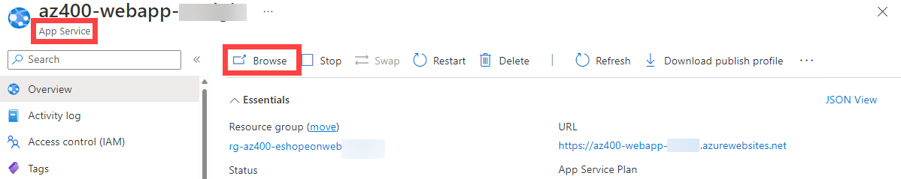

---
lab:
  topic: Intermediate
  title: "Implement GitHub Actions for CI/CD"
  description: "Learn how to implement a GitHub Action workflow that deploys an Azure web app using Service Principal authentication and GitHub environments."
---

# Implement GitHub Actions for CI/CD

In this lab, you'll learn how to implement a GitHub Action workflow that deploys an Azure web app. You'll work with GitHub repositories, Azure Service Principals, and automated deployment workflows.

You will learn how to:

- Import and configure a GitHub repository for CI/CD.
- Create an Azure Service Principal for GitHub Actions authentication.
- Implement a GitHub Action workflow for CI/CD.
- Set up GitHub environments with manual approval gates.
- Deploy applications to Azure using GitHub Actions.

This lab takes approximately **40** minutes to complete.

## Before you start

To complete the lab, you need:

- **Microsoft Edge** or an [Azure DevOps supported browser.](https://docs.microsoft.com/azure/devops/server/compatibility)
- **An Azure subscription**: If you don't already have an Azure subscription, sign up for a free account at [Azure Free Account](https://azure.microsoft.com/free).
- Verify that you have a Microsoft account or a Microsoft Entra account with the **Contributor** or the **Owner** role in the Azure subscription. For details, refer to [List Azure role assignments using the Azure portal](https://docs.microsoft.com/azure/role-based-access-control/role-assignments-list-portal) and [View and assign administrator roles in Azure Active Directory](https://docs.microsoft.com/azure/active-directory/roles/manage-roles-portal).
- **A GitHub account**: If you don't already have a GitHub account that you can use for this lab, follow instructions available at [Signing up for a new GitHub account](https://github.com/join) to create one.

## Import eShopOnWeb to your GitHub Repository

In this section, you will import the existing [eShopOnWeb](https://github.com/MicrosoftLearning/eShopOnWeb) repository code to your own GitHub public repository.

The repository is organized the following way:

- **.ado** folder contains Azure DevOps YAML pipelines.
- **.devcontainer** folder container setup to develop using containers (either locally in VS Code or GitHub Codespaces).
- **infra** folder contains Bicep & ARM infrastructure as code templates used in some lab scenarios.
- **.github** folder container YAML GitHub workflow definitions.
- **src** folder contains the .NET 8 website used on the lab scenarios.

### Create a public repository in GitHub and import eShopOnWeb

In this task, you will create an empty public GitHub repository and import the existing [eShopOnWeb](https://github.com/MicrosoftLearning/eShopOnWeb) repository.

1. From the lab computer, start a web browser, navigate to the [GitHub website](https://github.com/), sign in using your account and select on **New** to create new repository.

   

1. On the **Create a new repository** page, select on **Import a repository** link (below the page title).

   > **Note**: you can also open the import website directly at <https://github.com/new/import>

1. On the **Import your project to GitHub** page:

   | Field                              | Value                                             |
   | ---------------------------------- | ------------------------------------------------- |
   | The URL for your source repository | <https://github.com/MicrosoftLearning/eShopOnWeb> |
   | Owner                              | Your account alias                                |
   | Repository Name                    | eShopOnWeb                                        |
   | Privacy                            | **Public**                                        |

1. Select on **Begin Import** and wait for your repository to be ready.

1. On the repository page, go to **Settings**, select on **Actions > General** and choose the option **Allow all actions and reusable workflows**. Select on **Save**.

   

## Setup your GitHub Repository and Azure access

In this section, you will create an Azure Service Principal to authorize GitHub accessing your Azure subscription from GitHub Actions. You will also setup the GitHub workflow that will build, test and deploy your website to Azure.

### Create an Azure Service Principal and save it as GitHub secret

In this task, you will create the Azure Service Principal used by GitHub to deploy the desired resources. As an alternative, you could also use [OpenID connect in Azure](https://docs.github.com/actions/deployment/security-hardening-your-deployments/configuring-openid-connect-in-azure), as a secretless authentication mechanism.

1. On your lab computer, in a browser window, open the Azure Portal at `https://portal.azure.com`.
1. In the portal, look for **Resource Groups** and select on it.
1. Select on **+ Create** to create a new Resource Group for the exercise.
1. On the **Create a resource group** tab, give the following name to your Resource Group: **rg-eshoponweb-NAME** (replace NAME for some unique alias). Select on **Review + Create > Create**.
1. In the Azure Portal, open the **Cloud Shell** (next to the search bar).

   > **Note**: if the Azure portal asks you to create a storage, you can choose **No storage account required** options, select your subscription and select on **Apply** button

1. Make sure the terminal is running in **Bash** mode and execute the following command, replacing **SUBSCRIPTION-ID** and **RESOURCE-GROUP** with your own identifiers (both can be found on the **Overview** page of the Resource Group):

   ```bash
   az ad sp create-for-rbac --name GH-Action-eshoponweb --role contributor --scopes /subscriptions/SUBSCRIPTION-ID/resourceGroups/RESOURCE-GROUP --sdk-auth
   ```

   > **Note**: Make sure this is typed or pasted as a single line!

   > **Note**: this command will create a Service Principal with Contributor access to the Resource Group created before. This way we make sure GitHub Actions will only have the permissions needed to interact only with this Resource Group (not the rest of the subscription)

1. The command will output a JSON object, you will later use it as a GitHub secret for the workflow. Copy the JSON. The JSON contains the identifiers used to authenticate against Azure in the name of a Microsoft Entra identity (service principal).

   ```JSON
       {
           "clientId": "<GUID>",
           "clientSecret": "<GUID>",
           "subscriptionId": "<GUID>",
           "tenantId": "<GUID>",
           (...)
       }
   ```

1. (Skip if already registered) You also need to run the following command to register the resource provider for the **Azure App Service** you will deploy later:

   ```bash
   az provider register --namespace Microsoft.Web
   ```

1. In a browser window, go back to your **eShopOnWeb** GitHub repository.
1. On the repository page, go to **Settings**, select on **Secrets and variables > Actions**. Select on **New repository secret**

   - Name : **`AZURE_CREDENTIALS`**
   - Secret: **paste the previously copied JSON object** (GitHub is able to keep multiple secrets under same name, used by [azure/login](https://github.com/Azure/login) action )

1. Select on **Add secret**. Now GitHub Actions will be able to reference the service principal, using the repository secret.

### Modify and execute the GitHub workflow

In this task, you will modify the given GitHub workflow and execute it to deploy the solution in your own subscription.

1. In a browser window, go back to your **eShopOnWeb** GitHub repository.
1. On the repository page, go to **Code** and open the following file: **eShopOnWeb/.github/workflows/eshoponweb-cicd.yml**. This workflow defines the CI/CD process for the given .NET 8 website code.
1. Uncomment the **on** section (delete "#"). The workflow triggers with every push to the main branch and also offers manual triggering ("workflow_dispatch").
1. In the **env** section, make the following changes:
   - Replace **NAME** in **RESOURCE-GROUP** variable. It should be the same resource group created in previous steps.
   - (Optional) You can choose your closest [azure region](https://azure.microsoft.com/explore/global-infrastructure/geographies) for **LOCATION**. For example, "eastus", "eastasia", "westus", etc.
   - Replace **YOUR-SUBS-ID** in **SUBSCRIPTION-ID**.
   - Replace **NAME** in **WEBAPP-NAME** with some unique alias. It will be used to create a globally unique website using Azure App Service.
1. Read the workflow carefully, comments are provided to help understand.

1. Select on **Commit changes...** on top right and **Commit changes** leaving defaults (changing the main branch). The workflow will get automatically executed.

### Review GitHub Workflow execution

In this task, you will review the GitHub workflow execution:

1. In a browser window, go back to your **eShopOnWeb** GitHub repository.
1. On the repository page, go to **Actions**, you will see the workflow setup before executing. Select on it.

   

1. Wait for the workflow to finish. From the **Summary** you can see the two workflow jobs, the status and Artifacts retained from the execution. You can select in each job to review logs.

   

1. In a browser window, go back to the Azure Portal at `https://portal.azure.com`. Open the resource group created before. You will see that the GitHub Action, using a bicep template, has created an Azure App Service Plan + App Service. You can see the published website opening the App Service and selecting **Browse**.

   

### (OPTIONAL) Add manual approval pre-deploy using GitHub Environments

In this task, you will use GitHub environments to ask for manual approval before executing the actions defined on the deploy job of your workflow.

1. On the repository page, go to **Code** and open the following file: **eShopOnWeb/.github/workflows/eshoponweb-cicd.yml**.
1. In the **deploy** job section, you can find a reference to an **environment** called **Development**. GitHub used [environments](https://docs.github.com/en/actions/deployment/targeting-different-environments/using-environments-for-deployment) add protection rules (and secrets) for your targets.

1. On the repository page, go to **Settings**, open **Environments** and select **New environment**.
1. Give it **`Development`** name and select on **Configure Environment**.

   > **Note**: If an environment called **Development** already exists in the **Environments** list, open its configuration by selecting on the environment name.

1. In the **Configure Development** tab, check the option **Required Reviewers** and your GitHub account as a reviewer. Select on **Save protection rules**.
1. Now lets test the protection rule. On the repository page, go to **Actions**, select on **eShopOnWeb Build and Test** workflow and select on **Run workflow > Run workflow** to execute manually.

   

1. Select on the started execution of the workflow and wait for **buildandtest** job to finish. You will see a review request when **deploy** job is reached.

1. Select on **Review deployments**, check **Development** and select on **Approve and deploy**.

   

1. Workflow will follow the **deploy** job execution and finish.

## Clean up resources

When you complete the lab, it's important to clean up your Azure resources to avoid unnecessary charges:

### Delete the Azure resources

1. In the Azure Portal at `https://portal.azure.com`, navigate to the **Resource groups** section.
1. Find and select the **rg-eshoponweb-NAME** resource group you created.
1. On the resource group page, select **Delete resource group**.
1. Type the resource group name to confirm deletion and select **Delete**.
1. Wait for the deletion process to complete.

### Clean up GitHub resources (optional)

If you want to clean up your GitHub repository:

1. Navigate to your **eShopOnWeb** repository on GitHub.
1. Go to **Settings** and scroll down to the **Danger Zone**.
1. Select **Delete this repository** and follow the prompts to confirm deletion.

> **CAUTION:** Deleting the repository will permanently remove all code, issues, pull requests, and other repository data.

> **IMPORTANT**: Remember to delete the Azure resources to avoid unnecessary charges. The GitHub repository can remain as part of your portfolio.
